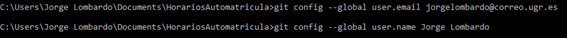
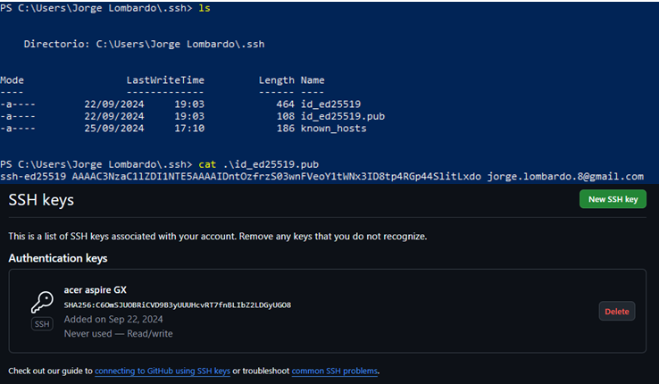

# HorariosAutomatrícula
Repositorio de Jorge Lombardo de la asignatura IV.

## Descripción del problema
Todos los años, una gran cantidad de alumnos de Ingeniería Informática de la UGR tienen problemas con su horario al comenzar el curso tras realizar la automatrícula, ya que el resultado suele incluir asignaturas cuyos horarios coinciden. Por este motivo, es necesario modificar la matrícula, lo que provoca que muchos de ellos se incorporen a una o varias asignaturas ya iniciadas, durante un par de semanas o incluso hasta un mes si hablamos de subgrupos de prácticas, generando numerosos problemas al iniciar el curso académico.

## Más información
[Documento con los horarios de Ingeniería Infomática UGR](https://etsiit.ugr.es/sites/centros/etsiit/public/inline-files/HorariosGII%2824-25%29_0.pdf)  
[Licencia](./LICENSE)  
[Ver archivo .gitignore](./.gitignore)
> Se irá actualizando conforme se usen lenguajes o librerías

## Configuración
Configuración correcta de correo electrónico y nombre  
  
Ejemplo para demostrar su funcionamiento correcto  
  
LLaves creadas y asociadas a la cuenta de GitHub  
  
Autenticación correcta  
  

## Objetivo 1  
[Milestones](docs/material_1/milestones.md)
